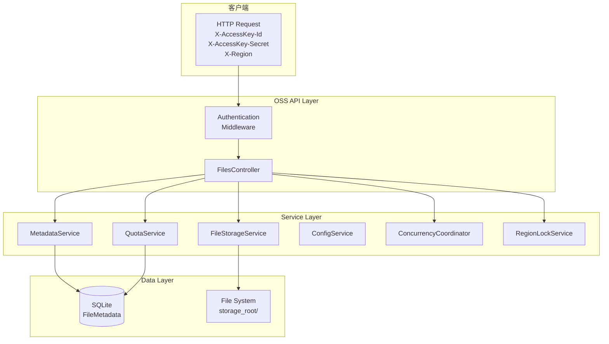

# LittleOSS

轻量级对象存储服务（Lite Object Storage Service）。

## 功能特性

- 多区域存储支持
- 文件上传、下载、删除、列表查询
- 存储配额管理
- 基于 AccessKey 的认证授权
- 并发控制与区域锁

## 快速开始

### 环境要求

- .NET 9.0 SDK
- SQLite

### 配置

在 `appsettings.json` 中配置 AccessKey 和区域：

### Oss 配置

| 配置项 | 类型 | 说明 |
|--------|------|------|
| `StorageRoot` | string | 文件存储根目录，默认为 `./oss-storage` |
| `Regions` | string[] | 可用的区域列表，如 `cn-east-1`、`us-west-1` |
| `MaxQuotaPerRegion` | object | 各区域的最大存储配额，支持 `KB`、`MB`、`GB` 单位 |
| `MaxFileSizeBytes` | number | 单个文件的最大大小限制，单位为字节 |

### AccessKeys 配置

| 配置项 | 类型 | 说明 |
|--------|------|------|
| `KeyId` | string | AccessKey 唯一标识，用于客户端认证 |
| `SecretKey` | string | AccessKey 密钥，需妥善保管 |
| `EnabledRegions` | string[] | 该 Key 允许访问的区域，`"*"` 表示全部区域 |

```json
{
  "Oss": {
    "StorageRoot": "./oss-storage",
    "Regions": [
      "cn-east-1",
      "us-west-1"
    ],
    "MaxQuotaPerRegion": {
      "cn-east-1": "10GB",
      "us-west-1": "5GB"
    },
    "MaxFileSizeBytes": 10485760
  },
  "AccessKeys": [
    {
      "KeyId": "oss-key-001",
      "SecretKey": "secret-xxx",
      "EnabledRegions": [ "*" ]
    }
  ]
}
```

### 运行

```bash
dotnet run
```

服务启动后访问 `http://localhost:5048`。

## API 文档

所有 API 需通过请求头携带认证信息：

| 请求头 | 说明 |
|--------|------|
| `X-AccessKey-Id` | AccessKey ID |
| `X-AccessKey-Secret` | AccessKey 密钥 |

### 查询配额

```
GET /api/{region}/quota
```

响应示例：

```json
{
  "region": "cn-east-1",
  "usedBytes": 3093534,
  "quotaBytes": 10737418240,
  "usedPercentage": 0.0288107804954052
}
```

### 列出文件

```
GET /api/{region}/files?skip=0&take=100
```

响应示例：

```json
{
  "total": 5,
  "files": [
    {
      "fileId": "78bd4c8eb33542178924278edf7b3f27",
      "originalFileName": "test.tar.gz",
      "region": "cn-east-1",
      "fileSizeBytes": 3093534,
      "contentType": "application/gzip",
      "uploadTime": "2026-05-20T03:30:00Z"
    }
  ]
}
```

### 上传文件

```
PUT /api/{region}/files
Content-Type: multipart/form-data
```

响应示例：

```json
{
  "fileId": "78bd4c8eb33542178924278edf7b3f27",
  "originalFileName": "test.tar.gz",
  "region": "cn-east-1",
  "fileSizeBytes": 3093534,
  "contentType": "application/gzip",
  "uploadTime": "2026-05-20T03:30:00Z"
}
```

返回 `201 Created`，响应头 `Location` 指向下载链接。

### 下载文件

```
GET /api/{region}/files/{fileId}
```

### 删除文件

```
DELETE /api/{region}/files/{fileId}
```

成功删除返回 `204 No Content`。

## 错误码

| 状态码 | 错误码 | 说明 |
|--------|--------|------|
| 400 | `INVALID_REGION` | 区域无效 |
| 401 | - | 认证失败 |
| 403 | `ACCESS_DENIED` | 无权访问该区域 |
| 404 | `FILE_NOT_FOUND` | 文件不存在 |
| 413 | `FILE_TOO_LARGE` | 文件超过大小限制 |
| 413 | `QUOTA_EXCEEDED` | 存储配额不足 |
| 500 | `UPLOAD_FAILED` / `DELETE_FAILED` | 服务器内部错误 |

## 架构图



## 项目结构

```
LittleOSS/
├── Authentication/
│   └── OssAuthenticationHandler.cs   # AccessKey 认证处理
├── Controllers/
│   └── FilesController.cs            # RESTful API 控制器
├── Data/
│   └── OssDbContext.cs               # EF Core SQLite 上下文
├── Models/
│   ├── AccessKey.cs                  # AccessKey 实体
│   ├── FileMetadata.cs               # 文件元数据实体
│   ├── Requests/                    # 请求模型
│   └── Responses/                   # 响应模型
├── Options/
│   └── OssOptions.cs                 # 配置选项绑定
├── Services/
│   ├── FileStorageService.cs         # 文件物理存储
│   ├── MetadataService.cs           # 元数据 CRUD
│   ├── QuotaService.cs               # 配额管理
│   ├── OssConfigService.cs           # 配置读取
│   ├── ConcurrencyCoordinator.cs    # 并发协调器
│   └── RegionLockService.cs          # 区域锁服务
├── Program.cs                        # 程序入口
├── appsettings.json                  # 配置文件
└── LittleOSS.csproj
```
