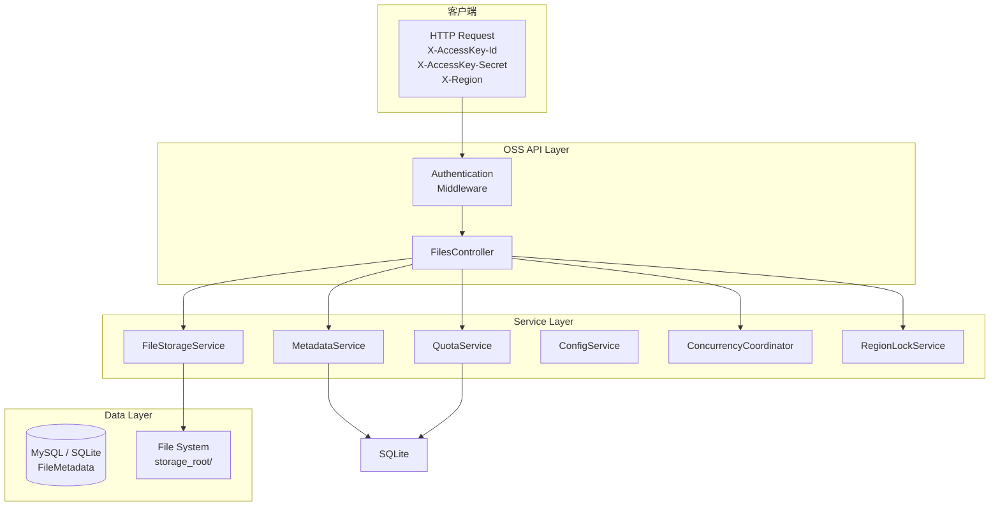

# LittleOSS

轻量级对象存储服务（Lite Object Storage Service）。

## 功能特性

- 多区域存储支持
- 文件上传、下载、删除、列表查询
- 存储配额管理
- 基于 AccessKey 的认证授权
- 并发控制与区域锁

## 快速开始

### 环境要求

- .NET 9.0 SDK
- SQLite 或 MySQL 8.0+

### 配置

在 `appsettings.json` 中配置 AccessKey 和区域：

### Oss 配置

| 配置项 | 类型 | 说明 |
|--------|------|------|
| `StorageRoot` | string | 文件存储根目录，默认为 `./oss-storage` |
| `Regions` | string[] | 可用的区域列表，如 `cn-east-1`、`us-west-1` |
| `MaxQuotaPerRegion` | object | 各区域的最大存储配额，支持 `KB`、`MB`、`GB` 单位 |
| `MaxFileSizeBytes` | number | 单个文件的最大大小限制，单位为字节 |

### AccessKeys 配置

| 配置项 | 类型 | 说明 |
|--------|------|------|
| `KeyId` | string | AccessKey 唯一标识，用于客户端认证 |
| `SecretKey` | string | AccessKey 密钥，需妥善保管 |
| `EnabledRegions` | string[] | 该 Key 允许访问的区域，`"*"` 表示全部区域 |

### Database 配置

| 配置项 | 类型 | 说明 |
|--------|------|------|
| `Provider` | string | 数据库类型，支持 `Sqlite`（默认）和 `MySql` |
| `ConnectionString` | string | MySQL 连接字符串（当 Provider=MySql 时使用） |
| `SqlitePath` | string | SQLite 数据库文件路径，默认为 `oss.db` |

```json
{
  "Oss": {
    "StorageRoot": "./oss-storage",
    "Regions": [
      "cn-east-1",
      "us-west-1"
    ],
    "MaxQuotaPerRegion": {
      "cn-east-1": "10GB",
      "us-west-1": "5GB"
    },
    "MaxFileSizeBytes": 10485760,
    "Database": {
      "Provider": "Sqlite",
      "ConnectionString": "Server=localhost;Port=3306;Database=littleoss;User=root;Password=;",
      "SqlitePath": "oss.db"
    }
  },
  "AccessKeys": [
    {
      "KeyId": "oss-key-001",
      "SecretKey": "secret-xxx",
      "EnabledRegions": [ "*" ]
    }
  ]
}
```

### 数据库初始化

应用启动时会调用 `Database.EnsureCreatedAsync()` 自动建库建表（SQLite 和 MySQL 均是），一般情况下无需手工初始化数据库。

如需手工初始化（DBA 审批、CI/CD、容器化部署、单独审阅 DDL 等场景），可直接执行 `sql/` 下对应的脚本：

**MySQL** —— [`sql/init.sql`](sql/init.sql)

```bash
# MySQL Shell（推荐，PowerShell / cmd / bash 通用）
mysqlsh --sql --uri "mysql://root:密码@127.0.0.1:3306" -f sql/init.sql

# 或 mysql 客户端（用 source 命令，等价于 `.read`）
mysql -h 127.0.0.1 -P 3306 -u root -p -e "source sql/init.sql"
```

会创建数据库 `littleoss`（库名需与 `Oss.Database.ConnectionString` 中的 `Database` 一致）以及 `FileMetadatas` 表和相关索引。

**SQLite** —— [`sql/init.sqlite.sql`](sql/init.sqlite.sql)

```bash
sqlite3 oss.db ".read sql/init.sqlite.sql"
```

SQLite 没有独立的建库语句，目标文件不存在时会被自动创建；文件路径需与 `Oss.Database.SqlitePath` 一致（默认 `oss.db`，相对内容根目录解析）。

> 上面的 `.read` / `source` 写法在 PowerShell 和 cmd 下都可用。等价的输入重定向写法 `sqlite3 oss.db < sql/init.sqlite.sql`、`mysql ... < sql/init.sql` 只在 cmd / bash 下有效——**PowerShell 不支持 `<` 输入重定向**。

两个脚本都是幂等的，可重复执行；表名、列类型、NULL 约束、主键与索引均与 EF 实际生成的结构一致（已逐项比对验证）。

> ⚠️ `EnsureCreatedAsync()` 只在库中**一张表都没有**时建表，不会比对或补齐已有表结构。因此用脚本预建表是安全的（EF 会自动跳过），但也意味着 `sql/init.sql` 与 `sql/init.sqlite.sql` 必须与 EF 模型（`Data/OssDbContext.cs`、`Models/FileMetadata.cs`）保持一致；模型变更后需同步修改这两个文件，表结构会持续演进时建议改用 EF Migrations。

### 运行

```bash
dotnet run
```

服务启动后访问 `http://localhost:5048`。

### 使用 curl 测试

```bash
# 上传文件
curl -X PUT http://localhost:5048/api/cn-east-1/files \
  -H "X-AccessKey-Id: oss-key-001" \
  -H "X-AccessKey-Secret: secret-xxx" \
  -F "file=@test.tar.gz"

# 下载文件
curl -O -J -H "X-AccessKey-Id: oss-key-001" -H "X-AccessKey-Secret: secret-xxx"   "http://localhost:5048/api/cn-east-1/files/78bd4c8eb33542178924278edf7b3f27"

# 删除指定文件
curl -X DELETE "http://localhost:5048/api/cn-east-1/files/78bd4c8eb33542178924278edf7b3f27" \
  -H "X-AccessKey-Id: oss-key-001" \
  -H "X-AccessKey-Secret: secret-xxx"

# 列出所有文件（默认最多 100 条）
curl -X GET "http://localhost:5048/api/cn-east-1/files" \
  -H "X-AccessKey-Id: oss-key-001" \
  -H "X-AccessKey-Secret: secret-xxx"

# 分页查询（跳过前 10 条，取 20 条）
curl -X GET "http://localhost:5048/api/cn-east-1/files?skip=10&take=20" \
  -H "X-AccessKey-Id: oss-key-001" \
  -H "X-AccessKey-Secret: secret-xxx"

# 查询配额
curl http://localhost:5048/api/cn-east-1/quota \
  -H "X-AccessKey-Id: oss-key-001" \
  -H "X-AccessKey-Secret: secret-xxx"
```

## API 文档

所有 API 需通过请求头携带认证信息：

| 请求头 | 说明 |
|--------|------|
| `X-AccessKey-Id` | AccessKey ID |
| `X-AccessKey-Secret` | AccessKey 密钥 |

### 查询配额

```
GET /api/{region}/quota
```

响应示例：

```json
{
  "region": "cn-east-1",
  "usedBytes": 3093534,
  "quotaBytes": 10737418240,
  "usedPercentage": 0.0288107804954052
}
```

### 列出文件

```
GET /api/{region}/files?skip=0&take=100
```

响应示例：

```json
{
  "total": 5,
  "files": [
    {
      "fileId": "78bd4c8eb33542178924278edf7b3f27",
      "originalFileName": "test.tar.gz",
      "region": "cn-east-1",
      "fileSizeBytes": 3093534,
      "contentType": "application/gzip",
      "uploadTime": "2026-05-20T03:30:00Z"
    }
  ]
}
```

### 上传文件

```
PUT /api/{region}/files
Content-Type: multipart/form-data
```

响应示例：

```json
{
  "fileId": "78bd4c8eb33542178924278edf7b3f27",
  "originalFileName": "test.tar.gz",
  "region": "cn-east-1",
  "fileSizeBytes": 3093534,
  "contentType": "application/gzip",
  "uploadTime": "2026-05-20T03:30:00Z"
}
```

返回 `201 Created`，响应头 `Location` 指向下载链接。

### 下载文件

```
GET /api/{region}/files/{fileId}
```

### 删除文件

```
DELETE /api/{region}/files/{fileId}
```

成功删除返回 `204 No Content`。

## 错误码

| 状态码 | 错误码 | 说明 |
|--------|--------|------|
| 400 | `INVALID_REGION` | 区域无效 |
| 401 | - | 认证失败 |
| 403 | `ACCESS_DENIED` | 无权访问该区域 |
| 404 | `FILE_NOT_FOUND` | 文件不存在 |
| 413 | `FILE_TOO_LARGE` | 文件超过大小限制 |
| 413 | `QUOTA_EXCEEDED` | 存储配额不足 |
| 500 | `UPLOAD_FAILED` / `DELETE_FAILED` | 服务器内部错误 |

## 架构图



## 项目结构

```
LittleOSS/
├── Authentication/
│   └── OssAuthenticationHandler.cs   # AccessKey 认证处理
├── Controllers/
│   └── FilesController.cs            # RESTful API 控制器
├── Data/
│   └── OssDbContext.cs               # EF Core 数据库上下文（支持 MySQL/SQLite）
├── Models/
│   ├── AccessKey.cs                  # AccessKey 实体
│   ├── FileMetadata.cs               # 文件元数据实体
│   ├── Requests/                    # 请求模型
│   └── Responses/                   # 响应模型
├── Options/
│   └── OssOptions.cs                 # 配置选项绑定
├── Services/
│   ├── FileStorageService.cs         # 文件物理存储
│   ├── MetadataService.cs           # 元数据 CRUD
│   ├── QuotaService.cs               # 配额管理
│   ├── OssConfigService.cs           # 配置读取
│   ├── ConcurrencyCoordinator.cs    # 并发协调器
│   └── RegionLockService.cs          # 区域锁服务
├── Program.cs                        # 程序入口
├── appsettings.json                  # 配置文件
├── LittleOSS.csproj
└── tests                             # Python 测试脚本
```
